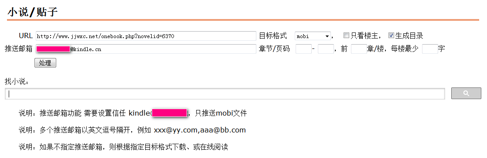
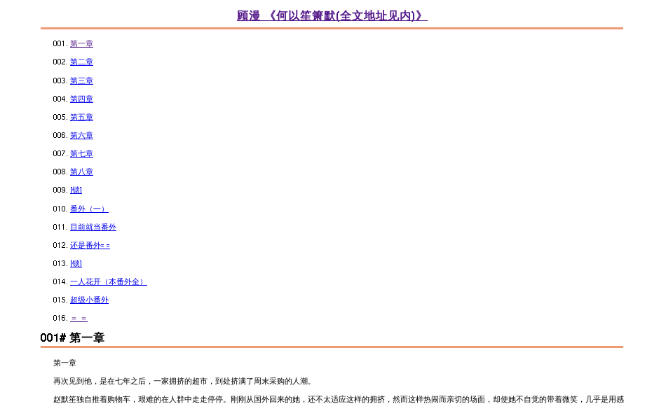
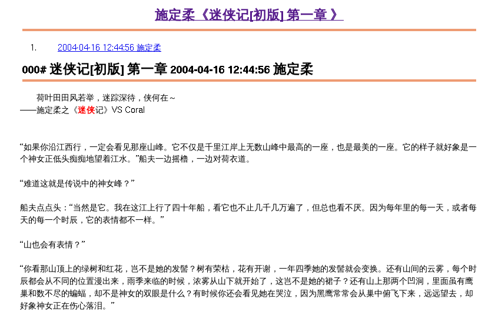

小说/贴子 在线处理
================

在线阅读 小说/贴子

将 小说/贴子 导出为 txt/html/mobi

将 小说/贴子 的mobi推送到指定邮箱

# novel_to_kindle 

每天自动将指定小说/贴子的mobi推送到指定kindle邮箱

注意需要在**亚马逊**配置允许信任当前推送server的邮箱地址

编辑``novel_to_kindle.pl``中的``$SERVER``、``$MYSQL``配置信息

## 安装perl模块

``cpanm Novel::Robot HTTP::Tiny SimpleR::Reshape SimpleDBI::mysql``

## 新建数据库表格

    CREATE TABLE `push_to_kindle` (
      `url` varchar(150) COLLATE utf8_unicode_ci NOT NULL DEFAULT '',
      `mail` varchar(50) COLLATE utf8_unicode_ci NOT NULL DEFAULT '',
      `novel_id` int(11) DEFAULT NULL,
      `note` varchar(50) CHARACTER SET utf8 DEFAULT NULL,
      PRIMARY KEY (`url`,`mail`)
    )

## 加入crontab

``0 16 * * *   cd /somepath && /usr/bin/perl novel_to_kindle.pl >/dev/null 2>&1``
