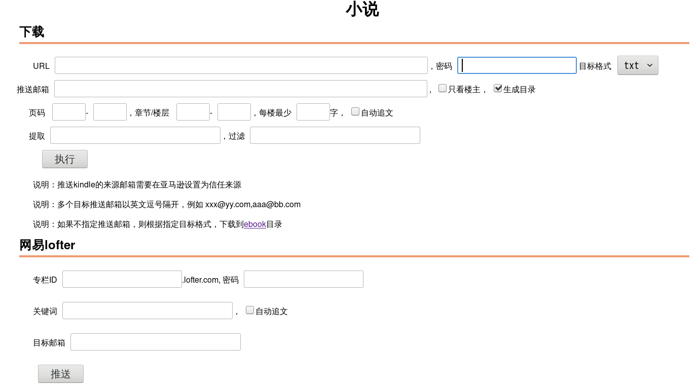

自动追文
========

将 小说/贴子 导出为txt/html/mobi/epub，支持推送到指定电子邮件地址，支持自动追文

密码采用最简单的bare token模式，以https访问页面

# 说明

以debian环境为例，需要安装apache2, MariaDB, ansible, exim4, ansible, Novel::Robot等相关工具

xs 目录为web页面代码，使用perl的mojo开发，负责在线写入任务到数据库

/usr/local/bin/novel_minion_worker.pl 负责执行小说下载任务，使用perl的Minion模块

crontab 负责执行小说更新任务

/etc/apache2/sites-enabled 目录下的conf文件为apache2配置，假设使用letsencrypt的证书，域名为xs.myebookserver.com, 本地目录为/var/www/xs

假设:

1) 推送的exim4邮件服务器为 mail.myebookserver.com，推送源邮箱为 kindle@myebookserver.com

2) 在线临时存放小说的服务器为web.myebookserver.com，路径为/var/www/html/ebook，对应的web地址为 http://web.myebookserver.com/ebook/

3) 注意需要在**亚马逊**配置kindle@myebookserver.com为可信来源

# 安装

    apt-get -y install apache2 libapache2-mod-perl2
    apt-get -y install libapache2-mod-php php php-pear php-curl
    apt-get -y install mariadb-server php-mysql
    apt-get -y install imagemagick php-imagick php-gd
    apt-get -y install exim4 ansible rsync sendemail calibre
    cpanm -n Novel::Robot SimpleDBI
    cpanm -n Plack Plack::Handler::Apache2 
    cpanm -n Mojolicious::Lite Mojolicious::Static Mojo::Template 
    cpanm -n Encode::Locale JSON Capture::Tiny Digest::MD5
    cpanm -n Minion Config::Simple

# minion 数据库存放即时指定下载的任务

    create database minion;

# novel数据库的update_novel表存放每天自动追文的任务

    create database novel;

    update_novel结构见 db/novel_struct.sql

#  /etc/systemd/system/novel.service 负责定期执行novel_minion_worker.pl，避免程序失效

    # systemctl enable novel.service 
    # systemctl start novel.service

# minion

    nohup novel_minion_worker.pl &

#  crontab

    0 */6 * * * /usr/bin/perl /usr/local/bin/novel_auto_update.pl >/tmp/novel_auto_update.log 2>&1
